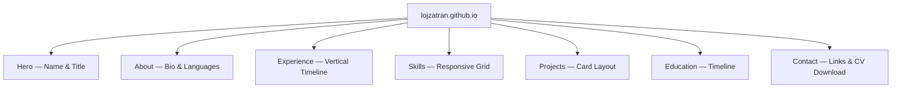
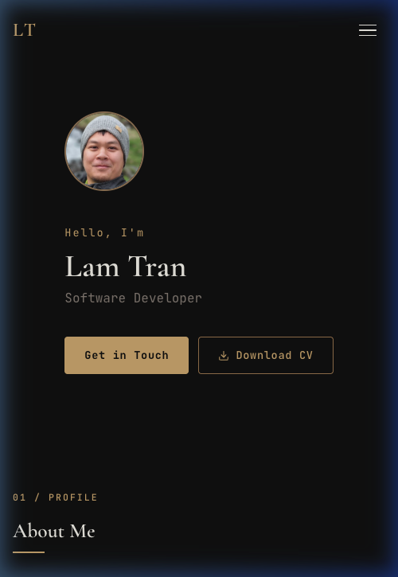
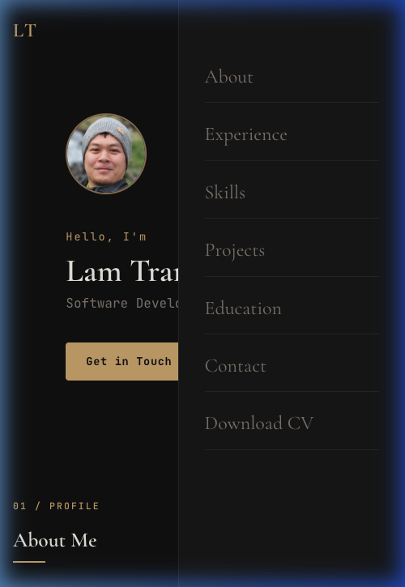

# Lam Tran — CV Portfolio

A modern, premium personal portfolio website presenting my professional resume as an interactive, animated web experience. Built with Preact and GSAP on a mobile-first, dark-themed design. Deployable as a static site on GitHub Pages.

## Installation

1. Clone the repository:
   ```bash
   git clone https://github.com/lojzatran/lojzatran.github.io.git
   cd lojzatran.github.io
   ```
2. Install dependencies:
   ```bash
   npm install
   ```

## Usage

1. The site is accessible at: **https://lojzatran.github.io**
2. Navigate sections using the top navigation bar (desktop) or hamburger menu (mobile).
3. Download the CV PDF using the "Download CV" button in the hero or contact section.

## Development

1. Start the development server:
   ```bash
   npm run dev
   ```
2. Open `http://localhost:5173` in a browser.
3. Edit content by modifying `src/data/cvData.ts`.
4. Adjust styles in `src/styles/theme.css` and `src/styles/components.css`.

## Deployment

1. Build the production bundle:
   ```bash
   npm run build
   ```
2. The output is placed in `dist/`. Push this to the `lojzatran.github.io` repository's default branch.

## Sitemap



---

# Screenshots

### Desktop View


### Mobile View

<p align="center">
  
  
</p>

---

# Human notes by me

### Introduction

1. All the codes until the commit where this section was added was all generated by AI (Claude Sonnet 4.6 and Gemini 3 Flash) on the first shot.
1. I use Google Antigravity and the free tier. It is not enough to generate the whole project with Claude Sonnet only, I had to switch to Gemini Flash.
1. I added 2 skills for this project: "frontend-design" and "pdf". Skills were taken from https://github.com/anthropics/skills.
1. In [`.specify`](.specify) folder you can see the specifications written by AI (Gemini 3 Flash) and updated by me.
   Specs were generated using [SpecKit](https://github.com/github/spec-kit). This is my first time with SpecKit.
1. Pushing to repo and deployment to GitHub Pages was done also by AI as part of the tasks. It has MCP connection to GitHub. You can see the result here: https://github.com/lojzatran/lojzatran.github.io
1. I supplied my CV as PDF and AI extracted the content from it to generate the content of the portfolio.

### Website review

1. It didn't manage to take links for the projects from the PDF.
1. Hero section was not visible at all and was all black. I had to ask AI explicitly to fix this. It also redeploys the project after the fix.
1. The folder structure is logical and follows best practices.
1. The dependencies are slightly outdated. I guess it's because it does not connect directly to npm, but it uses the data it was trained on.

### Learnings

1. It is hard to start with SpecKit if you only read the README from the project repo. I recommend to watch the video tutorial from SpecKit repo as well. I find this constitution example very useful: https://github.com/Azure-Samples/azure-speckit-constitution. And I also like this article that will help you to get started: https://www.epam.com/insights/ai/blogs/using-spec-kit-for-brownfield-codebase
1. I still think you need technical background to do this kind of development. Without technical background, you probably could generate something that is working, but you might miss a lot of things like MCP connections, skills, etc. Also it might not choose the best tech stack for your project. I wanted to a static website and it chose React, which is too much, so I updated it to Preact if it needed.
1. AI does not check the tasks once they're done. You have to explicitly specify it in the constitution.
1. AI does not suggest to add any documentations. I had to ask it explicitly to add README.md and give it a content.
1. When describing the specification, I told AI to get data from a PDF file that I will provide and wanted to provide it at a later point. However, it went ahead and looked through my computer (with my allowance to check the folders) and found a PDF with my CV and used it. I guess this must be specified more explicitly next time.
