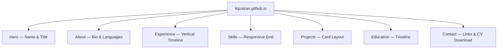

# Lam Tran — CV Portfolio

A modern, premium personal portfolio website presenting my professional resume as an interactive, animated web experience. Built with Preact and GSAP on a mobile-first, dark-themed design. Deployable as a static site on GitHub Pages.

## Installation

1. Clone the repository:
   ```bash
   git clone https://github.com/lojzatran/lojzatran.github.io.git
   cd lojzatran.github.io
   ```
2. Install dependencies:
   ```bash
   npm install
   ```

## Usage

1. The site is accessible at: **https://lojzatran.github.io**
2. Navigate sections using the top navigation bar (desktop) or hamburger menu (mobile).
3. Download the CV PDF using the "Download CV" button in the hero or contact section.

## Development

1. Start the development server:
   ```bash
   npm run dev
   ```
2. Open `http://localhost:5173` in a browser.
3. Edit content by modifying `src/data/cvData.ts`.
4. Adjust styles in `src/styles/theme.css` and `src/styles/components.css`.

## Deployment

1. Build the production bundle:
   ```bash
   npm run build
   ```
2. The output is placed in `dist/`. Push this to the `lojzatran.github.io` repository's default branch.

## Sitemap


